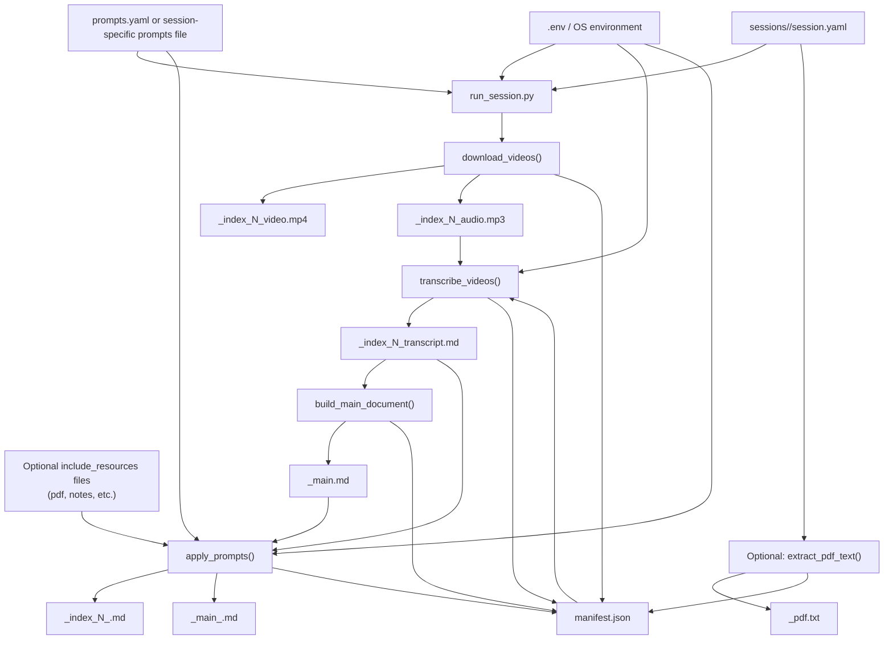

# Architecture

This document explains how `learning-session-transcriber` works from input files to generated outputs.

## Purpose

The app is a file-based pipeline for learning sessions:

1. Read a session definition from `sessions/<content_name>/session.yaml`.
2. Acquire video or audio input files.
3. Transcribe them with the OpenAI API.
4. Build a combined session document.
5. Optionally run prompt-based post-processing to generate extra study artifacts.

The design is intentionally simple: small modules, explicit files on disk, and a `manifest.json` that records generated artifacts.

## Main Entry Points

- Recommended CLI entry point: `learning-session-transcriber --config sessions/<content_name>/session.yaml`
- Equivalent module entry point: `python -m learning_session_transcriber.run_session --config ...`
- Step-specific modules also exist:
  - `learning_session_transcriber.downloader`
  - `learning_session_transcriber.transcriber`
  - `learning_session_transcriber.synthesizer`
  - `learning_session_transcriber.prompts`
  - `learning_session_transcriber.extract_pdf`
  - `learning_session_transcriber.audio_joiner`

## High-Level Flow

## Inputs

### 1. Session configuration

`session.yaml` is the main input and is loaded by `load_session_config()` in `src/learning_session_transcriber/sessions.py`.

It defines:

- `content_name`: session identifier and output filename prefix
- `topic`: session title used in the main document
- `language`: transcription language
- `llm_model`: preferred model for prompt post-processing
- `videos[]`: ordered source videos
- `main_postprocess_prompts`: prompt names for the combined document
- `prompts_file`: optional alternative prompts file
- `include_resources`: optional extra files attached to prompt requests
- `pdf`: optional PDF config for text extraction

Each video can provide either:

- `url` for download with `yt-dlp`
- `local_path` for copying an existing local file

### 2. Environment configuration

`src/learning_session_transcriber/config.py` loads configuration from OS environment and optional `.env`.

Important values:

- `OPENAI_API_KEY`
- `OPENAI_MODEL`
- `OPENAI_TRANSCRIPTION_MODEL`
- `LOG_LEVEL`

### 3. Prompt definitions

`prompts.yaml` defines reusable prompt templates in two groups:

- `per_video`
- `main_document`

Each prompt declares its `name`, `system_prompt`, `temperature`, `max_tokens`, and optional `include_resources`.

## Pipeline Stages

### 1. Orchestration

`src/learning_session_transcriber/run_session.py` is the coordinator.

Default pipeline:

- `download`
- `transcribe`
- `synthesize`
- `prompts`

Important detail:

- The `pdf` step exists but is not part of the default `ALL_STEPS` list, so it only runs if explicitly requested.

### 2. Download or collect videos

`src/learning_session_transcriber/downloader.py`

Responsibilities:

- Load session config
- Create `outputs/<content_name>/`
- For each video:
  - copy `local_path`, or
  - download from `url` using `yt-dlp`
- Extract MP3 audio from the video using `ffmpeg`
- Create or update `outputs/<content_name>/manifest.json`

Generated files:

- `<content_name>_index_<n>_video.mp4`
- `<content_name>_index_<n>_audio.mp3`

### 3. Transcription

`src/learning_session_transcriber/transcriber.py`

Responsibilities:

- Read `manifest.json`
- Prefer `audio_path` over `output_path`
- Split long audio into chunks with `ffmpeg`
- Send each chunk to `client.audio.transcriptions.create(...)`
- Concatenate chunk transcripts
- Write one Markdown transcript per video
- Update `manifest.json`

Generated files:

- `<content_name>_index_<n>_transcript.md`

### 4. Main document synthesis

`src/learning_session_transcriber/synthesizer.py`

Responsibilities:

- Discover `*_transcript.md` files in the session output folder
- Concatenate them into one combined Markdown file
- Add a session title and basic metadata
- Register the file in `manifest.json`

Generated file:

- `<content_name>_main.md`

### 5. Prompt-based post-processing

`src/learning_session_transcriber/prompts.py`

Responsibilities:

- Load prompt templates from `prompts.yaml` or a session-specific prompts file
- Run selected `per_video` prompts against each transcript
- Run selected `main_document` prompts against the synthesized main document
- Optionally attach `include_resources` content
- Write prompt output files
- Register generated files in `manifest.json`

Generated files:

- Per video: `<content_name>_index_<n>_<prompt_name>.md`
- Main document: `<content_name>_main_<prompt_name>.md`

### 6. Optional PDF extraction

`src/learning_session_transcriber/extract_pdf.py`

Responsibilities:

- Read `pdf.path` from `session.yaml`
- Extract text with `pypdf`
- Write plain text into the session output folder
- Register it in `manifest.json`

Generated file:

- `<content_name>_pdf.txt`

## Output Layout

All generated files for a session live in a flat folder:

- `outputs/<content_name>/`

Typical contents:

- `manifest.json`
- `<content_name>_index_1_video.mp4`
- `<content_name>_index_1_audio.mp3`
- `<content_name>_index_1_transcript.md`
- `<content_name>_main.md`
- `<content_name>_index_1_summary.md`
- `<content_name>_main_study_guide.md`

Even though some module docstrings still mention subfolders such as `videos/` or `transcripts/`, the current implementation writes everything directly into `outputs/<content_name>/`.

## Manifest Role

`src/learning_session_transcriber/manifest.py` manages `outputs/<content_name>/manifest.json`.

The manifest is the shared state between steps. It records where artifacts were written so later stages do not have to rediscover everything from scratch.

Typical data tracked in the manifest:

- video entry metadata by `index`
- `output_path`
- `audio_path`
- `transcript_path`
- `prompt_files`
- `main_doc_path`
- `pdf_path`

In practice, this makes the pipeline resumable and idempotent-friendly because most steps skip work when target files already exist.

## External Dependencies

The app depends on a few external services and tools:

- OpenAI API for transcription and prompt-based generation
- `yt-dlp` for remote video download
- `ffmpeg` for audio extraction, audio chunking, and audio joining
- `pypdf` for PDF text extraction

## Standalone Audio Joiner

`src/learning_session_transcriber/audio_joiner.py` is a separate workflow and does not use `session.yaml`.

It works like this:

1. Read `sessions/<name>/audio_metadata.yaml`
2. Scan the session folder for `.wav`, `.m4a`, and `.mp3`
3. Convert WAV/M4A to MP3 with `ffmpeg`
4. Generate silence segments
5. Join everything into one MP3
6. Write outputs to `outputs/<session_name>/`

This module is related to the repository's theme, but it is independent from the main transcription pipeline.

## Architecture Summary

The app follows a simple staged pipeline:

- `session.yaml` describes what to process
- `run_session.py` orchestrates the steps
- each module produces files in `outputs/<content_name>/`
- `manifest.json` connects one stage to the next
- OpenAI is used for transcription and optional post-processing

If you want to understand the code quickly, read these files first:

- `src/learning_session_transcriber/run_session.py`
- `src/learning_session_transcriber/sessions.py`
- `src/learning_session_transcriber/downloader.py`
- `src/learning_session_transcriber/transcriber.py`
- `src/learning_session_transcriber/synthesizer.py`
- `src/learning_session_transcriber/prompts.py`
- `src/learning_session_transcriber/manifest.py`
